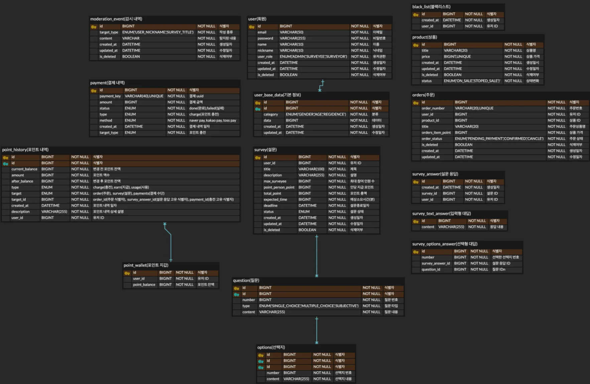

# Surmile

# 🖥️ 프로젝트 소개
### 😀써마일(surmile)💵

**survey + smile = surmile**

“설문에 웃음을 더하는 설문조사 기반 앱테크 리워드 플랫폼”

> 짧은 시간 투자로 포인트를 적립하고 보상을 받는 **앱테크 문화**가 빠르게 확산되고 있습니다.
동시에 개인·기업은 **온라인에서 손쉽게 설문을 배포하고 다수의 의견을 모으는 수요**가 커지고 있죠.

이러한 니즈를 바탕으로
**“설문 참여 ↔ 포인트 적립 ↔ 상품 교환”**을 하나로 잇는 통합 리워드 설문 플랫폼, **써마일**을 기획했습니다.

**써마일**에서는 사용자가 다양한 설문에 참여하면 포인트를 획득하고, 이를 원하는 상품으로 교환할 수 있습니다.
출제자는 개인·기업 누구나 필요 설문을 손쉽게 배포해 더 많은 응답을 빠르게 수집할 수 있어요.

### **설문은 간단하게, 보상은 확실하게!**

# 개발 환경 소개
| 분류         | 상세                                                      |
| ------------ | ------------------------------------------------------- |
| IDE          | IntelliJ IDEA                                           |
| Language     | Java 17                                                 |
| Framework    | Spring Boot 3.5.3                                       |
| Repository   | Maven Central, Spring Milestone, Spring Snapshot        |
| Build Tool   | Gradle                                                  |
| DevOps       | AWS EC2, Docker, Docker Compose, GitHub Actions         |
| DB           | MySQL, H2 (Test)                                       |
| Security     | Spring Security, JWT (jjwt 0.12.5)                     |
| Cache        | Redis, Redisson                                         |
| Testing      | JUnit 5, Spring Boot Test, Testcontainers               |
| Documentation| Spring REST Docs, Asciidoctor                            |

# 프로젝트 실행 방법
## 프로젝트 환경변수 설정

프로젝트 실행을 위해 아래와 같은 `.env` 파일을 루트 경로에 생성합니다.
```
## DB 설정
DB_URL=jdbc:mysql://localhost:3306/survey_app
DB_HOST=localhost
DB_PORT=3306
DB_NAME=sparta
DB_USERNAME=root
DB_PASSWORD=password

REDIS_HOST=localhost
REDIS_PORT=6379

## 외부 API 키
SECRET_KEY=your_super_secret_key_here
OPENAI_API_KEY=your_api_key_here 
```

# 설계 산출물
### ERD


### API 명세서
[API 명세서 보기](src/docs/assets/api_docs.html)


# 개발 산출물
## 트러블 슈팅
## 공통 관심사항
## 테스트코드

# 시스템을 발전 시키기 위해 더 해본다면?

# 협업 시 잘한 것들

# 협업 시 아쉽거나 부족했던 부분들


# 🎯 프로젝트 핵심 목표

# ⏩ KEY SUMMARY

# 🧩 인프라 아키텍처

# 🛠️ 적용 기술

# 📌 주요 기능

# 📈 기술적 고도화

# 💡 기술적 의사결정

# 👥 역할 분담 및 협업 방식

# 🚩 성과 및 회고